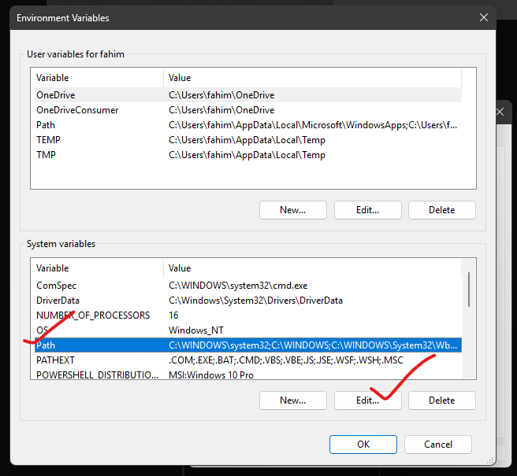

# Run LaTeX Projects Locally

If you use LaTeX to write your academic or research papers, you might be familiar with website-based applications like [Overleaf](https://www.overleaf.com/). Those sites are okay for small tasks or compilations or if you need only a little bit of free collaboration. 

However, if you need to work on bigger projects or need to conduct a lot of collaboration tasks, then the free tier becomes insufficient. The paid subscription costs too much there. Therefore, running LaTeX locally can be the perfect solution for you. I know this because I also faced a similar situation as well. But this solution simply changed my life! I also keep all of the tracks in Git (GitHub, GitLab, etc.) along with unlimited collaboration opportunities and compilation, and all of these are completely free as all of these are happening on my local machine. Therefore, I am going to discuss the methods in detail in this article. I have also created an in-depth video for you to understand more.

## Video Tutorial

<iframe
  width="100%"
  height="550"
  src="https://www.youtube.com/embed/A45lWrndVHA"
  title="LaTeX Tutorial"
  frameborder="0"
  allow="accelerometer; autoplay; clipboard-write; encrypted-media; gyroscope; picture-in-picture"
  allowfullscreen
></iframe>

## Operating System

You can install LaTeX on any major operating system (Windows, MacOS, and Linux-based OSes). However, in this article, I am only going to talk about the Windows operating system. Here, I used the latest Windows 11 operating system, but the same procedure should be applicable to all of the Windows-based operating systems that are going to come out in the future. Windows 10 should also be okay too!

## Editor

I am going to use the popular [Visual Studio Code](https://code.visualstudio.com/) as my editor. It is a 100% free and robust editor in the world right now. Therefore, make sure to install it before proceeding further.

## LaTeX Compiler/IDE

To work on LaTeX files, we need a specific compiler. I am going to use [MikTeX](https://miktex.org/). There are other tools out there, but this is the best tool right now (according to me!). It is completely free and supports all major operating systems as well. It also has a built-in IDE, but we are going to use VS Code as our main editor.

Download the Windows executable file from the Download section.

After the download is finished, install the executable. At the end of the installation, keep the tick in “Check for updates now”.

You will find the MikTeX console in your taskbar. Open that.

Go to the “Updates” tab and click “Update now”. It will install all of those packages.

At the end, it will prompt you to close the console. Click “OK”. Open MiKTeX again.

That’s it for this tool.

## Perl

The commands we are going to execute for building the LaTeX files are dependent on Perl. As the Windows operating system doesn’t come with a built-in Perl compiler, we are going to install the [Strawberry Perl](https://strawberryperl.com/).

Download the latest MSI package from it.

Install the executable after it gets finished downloading the application.

We need to add Perl’s path to the system environment. Therefore, go into the location where it has been installed. By default, it gets installed inside `C:\Strawberry\perl\bin` directory. Copy the path.

Now search for “env” in the Windows search bar until you find something called “Edit the system environment variable”.

Now click on “Environment Variables…”.

Now select “Path” from “System variables” and click “Edit”.

Click “New”. Paste the path. Now exit every windows sequentially by clicking on “OK” in each window.

## Visual Code Studio Extensions

We need some extensions in VS Code to streamline our workflow.

1. [LaTeX Workshop](https://marketplace.visualstudio.com/items?itemName=James-Yu.latex-workshop): It is the core extension for working with LaTeX files inside VS Code Studio.
   

2. [Rewrap](https://marketplace.visualstudio.com/items?itemName=stkb.rewrap): It is an amazing tool to wrap longer lines. It helps us to work in a long line in separate lines without breaking any structure or sentence.
   

## Build LaTeX File

Whenever you want to build any LaTeX file inside VS Code studio, simply open that file in it. Then open the command palette using `Ctrl` + `Shift` + `P`.

Search for “LaTeX Workshop: Build with recipe”. Enter on that. It will start building the file. Whenever it prompts you to install any missing package, untick the box that says “Always show this dialog” and press on “Install”. I do this as clicking on “Install” on 100/200/more than that prompt windows for building a LaTeX file is very difficult for me.

After it finishes building a LaTeX file, you will get the output PDF file inside VS Code. You can open the PDF file directly in VS Code.

If you want to go into any specific line in code from the output PDF file like Overleaf, simply click on that specific portion in the PDF by pressing the `Ctrl` key. It will immediately take you to the code part where it belongs.

That’s it! It is running on your local machine and therefore, there is no restrictions or limitation to it, literally! Also, for collaboration and keeping track of the history, using Git is the best option, like me!

## Conclusion

Thanks for reading this short tutorial. I hope it helped you interact more easily with LaTeX.

You can follow me on [GitHub](https://github.com/FahimFBA), [LinkedIn](https://www.linkedin.com/in/fahimfba/), and [You](https://www.linkedin.com/in/fahimfba/)[Tube](https://youtube.com/@FahimAmin) to get more content like this. Also, my [website](https://www.fahimbinamin.com/) is always available for you!