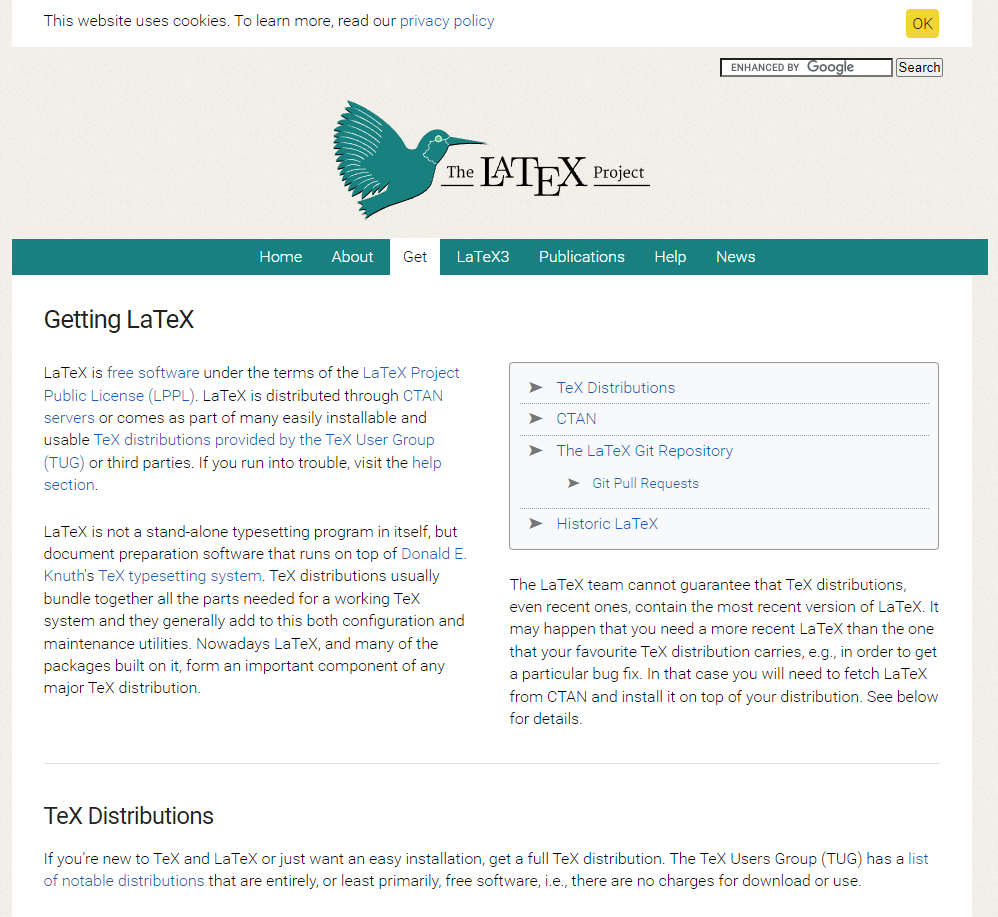
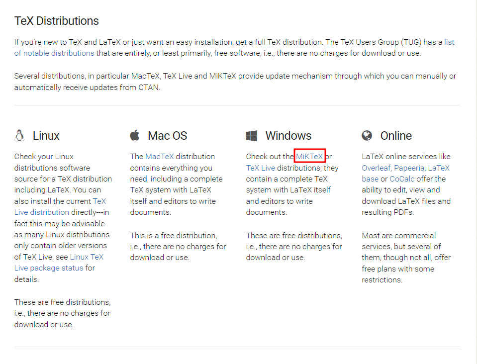
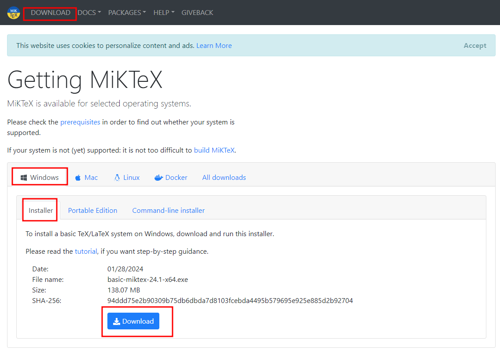

# Install LaTeX on Windows Operating System

## Introduction

This page provides you the complete guidelines on installing LaTeX on your Windows operating system. For this guideline, I have used the latest Windows 11 Pro operating system. However, this same method is completely applicable to all Windows 11 operating system.

## Download LaTeX Compiler (MiKTeX)

We need to download a LaTeX compiler in our operating system that compiles our LaTeX into PDF file. 

Firstly, we need to download the LaTeX compiler from the [LaTeX Project](https://www.latex-project.org/get/).

You have to scroll a little bit until you get the TeX Distributions. 

Click on **MiKTeX** from Windows section. It will take you to the official website of [MiKTeX](https://miktex.org/).

From here, click to **Download**. Then download the Windows Installer. 

## Install MiKTeX

